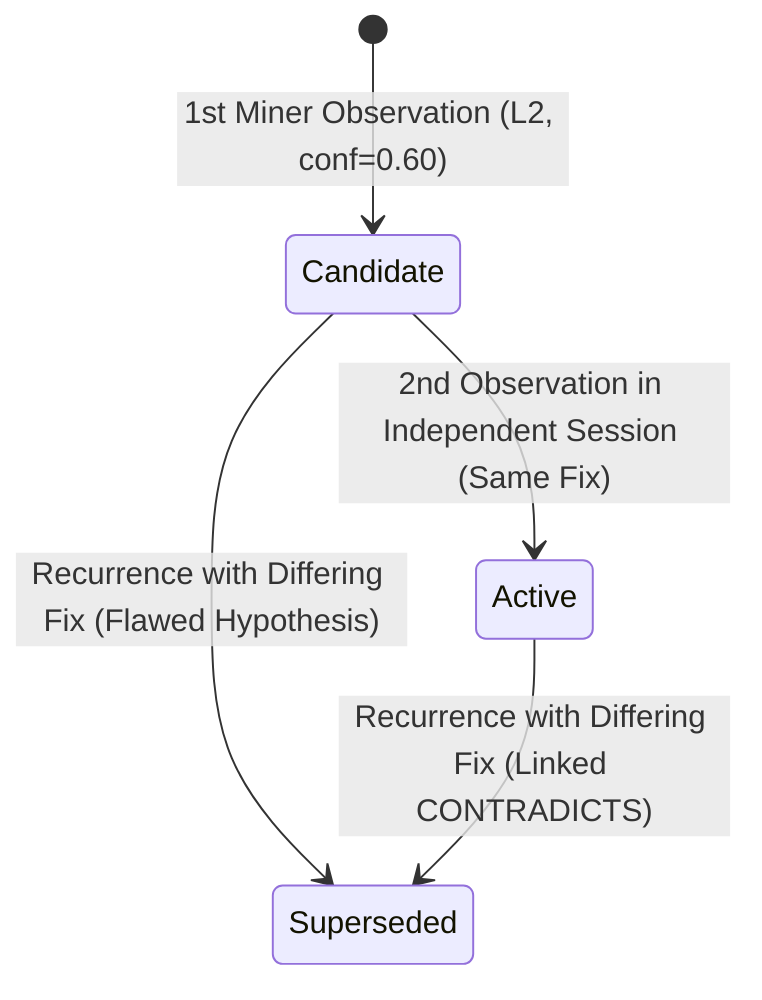

# Flightdeck Epistemic Causal Substrate (ECS)
### Next-Generation Deterministic Shared Memory for Autonomous Coding Agents

> **Thesis**: Traditional Vector RAG and generic cloud memory layers (e.g. Mem0) fail software engineering agents because they are **causally blind, semantically fuzzy, and structurally detached from the code graph**. Flightdeck ECS replaces vector similarity with a **local, deterministic, file-anchored causal execution substrate** versioned by Git.

---

## 1. Executive Summary & Problem Space

### Why Vector RAG Fails Coding Agents
Vector databases compute cosine distance over embedding vectors derived from unstructured chunks of natural language text. In software engineering, this produces fundamental failure modes:
1. **Semantic Similarity $\neq$ Causal Correctness**: Two code snippets can be 98% semantically identical while one contains a fatal compiler bug and the other is valid. Vector RAG cannot distinguish causal correctness from prose similarity.
2. **Token Bloat & Context Decay**: RAG pipelines dump paragraphs of conversational context into the agent's prompt (often 1,500–4,000 tokens), degrading the LLM's instruction attention and accelerating context window exhaustion.
3. **Stale Memory Poisoning**: As code evolves, vector stores retain outdated representations. An agent querying a months-old chunk receives instructions for functions or configurations that no longer exist, leading to hallucinations.

### Why Mem0 & Cloud Middleware Fail
1. **Zero-Cloud Privacy Violations**: Enterprise and security-conscious developers refuse to route proprietary source code, shell commands, and API interactions to third-party cloud memory platforms.
2. **High Latency Overhead**: Cloud memory roundtrips inject 300ms–800ms of latency into every agent turn.
3. **No Code Graph or Toolchain Awareness**: Generic cloud memory layers have no awareness of compilers (`swiftc`, `cargo`, `tsc`), test runners, AST symbols, or Git commit histories.

---

## 2. The Four Pillars of Flightdeck ECS

```
┌────────────────────────────────────────────────────────────────────────┐
│                   FLIGHTDECK COCKPIT DECK (GUI)                        │
│   ┌────────────────────────────────────────────────────────────────┐   │
│   │ [Traps: 3 Active] · [Proven Rules: 14] · [Causal Graph Viewer] │   │
│   └────────────────────────────────────────────────────────────────┘   │
└───────────────────────────────────▲────────────────────────────────────┘
                                    │ (0.1ms Local SQLite Query)
┌───────────────────────────────────┴────────────────────────────────────┐
│      Flightdeck Epistemic Causal Substrate (Native Swift + SQLite)     │
│                                                                        │
│  1. CAUSAL VERIFICATION TRIPLES (Hypothesis ➔ Compiler/Test ➔ Verdict) │
│  2. STIGMERGIC HAZARD TRAPS (Deterministic File & AST Anchoring)       │
│  3. GIT-VERSIONED TRUTH INVALIDATION (Zero Stale Memory Drift)         │
│  4. MICRO-CAPSULE ENCODING (<60 Tokens Per Rule, No Context Waste)     │
└───────────────────▲────────────────────────────────▲───────────────────┘
                    │                                │
            (Local JSON-RPC)                 (Local CLI Pipes)
┌───────────────────┴───────────────┐    ┌───────────┴───────────────────┐
│   Claude Code Session 1           │    │   Claude Code Session 2       │
│  (Fails compiler on enum case,    │    │  (Reads trap BEFORE editing,  │
│   stores causal fix into local DB)│    │   skips mistake completely)   │
└───────────────────────────────────┘    └───────────────────────────────┘
```

### Pillar 1: Causal Execution Triples
Software engineering is empirical cause-and-effect. Flightdeck ECS models memory as formal empirical tuples rather than prose embeddings:

$$\text{Memory Capsule} = \langle \text{Scope / File}, \text{Causal Trigger}, \text{Observed Failure}, \text{Proven Fix}, \text{Git SHA} \rangle$$

* **Scope**: The exact canonical file path and symbol (e.g. `Sources/Flightdeck/CLI.swift` / `handleSessions`).
* **Causal Trigger**: The command, syntax pattern, or parameter that prompted the state transition.
* **Observed Failure**: The compiler diagnostic, test failure message, or exit code.
* **Proven Fix**: The verified resolution that successfully compiled and passed tests.
* **Git SHA**: The tree state where this causal relationship was verified.

### Pillar 2: Stigmergic Code Anchoring
In biological stigmergy, social insects coordinate not through direct communication, but by leaving localized physical markers (pheromones) on the environment.
* **Negative Pheromones (Hazard Traps)**: If Session 1 attempts an edit on line 84 of `DevCleaner.swift` that triggers an invalid enum error or breaks unit tests, Flightdeck places a **Deterministic Hazard Marker** on that file in local storage.
* When Session 2 (or a concurrent agent) touches `DevCleaner.swift`, Flightdeck delivers an immediate micro-attunement:
  > `⚠️ HAZARD (DevCleaner.swift): Using .measured on ContextWindowSource fails compilation. Valid cases are .statusline, .inferred, .fallback.`
* **Zero guesswork, zero vector search uncertainty**—memory is deterministically addressed by repository coordinates.

### Pillar 3: Git-Versioned Truth Invalidation
To solve the "stale memory" problem that plagues vector stores:
* Every capsule records the `git rev-parse HEAD` commit and file content hash at the time of verification.
* When files are modified in subsequent commits, Flightdeck compares current Git tree state against capsule metadata:
  * **Unchanged**: State remains `ACTIVE` (100% confidence).
  * **Modified in Tree**: State transitions to `NEEDS_REVERIFICATION`.
  * **Deleted / Renamed**: State transitions to `OBSOLETE` or maps to the new path via Git rename tracking.

### Pillar 4: Micro-Capsule Token Density (<60 Tokens)
Standard RAG systems dump thousands of tokens into prompt context. Flightdeck compiles causal triples into ultra-dense, syntax-highlighted directives:

```markdown
[FLIGHTDECK MEMORY: Sources/Flightdeck/DevCleaner.swift]
- TRAP: Trigger: `.measured`
  Failure: type ContextWindowSource has no member 'measured'
  Resolution: Valid cases are .statusline, .inferred, .fallback
- RULE: Trigger: `cleanCargoRegistry`
  Resolution: Run DevCleanerTests before committing directory count logic
```
**Total footprint**: ~45 tokens. Zero context pollution; 100% actionable signal.

---


## 3. Architecture & Memory Profile: The Dual-Tier System

To satisfy strict operational footprint requirements while retaining cross-environment tool interoperability, ECS implements a **dual-tier architecture**:

| Tier | Engine / Stack | RAM Budget | Target Role |
| :--- | :--- | :--- | :--- |
| **Tier 1: Production Engine** | **Native Swift + GRDB** (single-connection `DatabaseQueue`, SQLite WAL mode) | **10–14 MB** | Embedded Flightdeck macOS daemon, instant CLI queries, zero Python runtime dependencies. |
| **Tier 2: Reference & MCP Server** | **Python 3.11+ / uv** (`mcp>=1.0.0`, single SQLite connection) | **45–60 MB** | Standalone headless JSON-RPC MCP server (`ecs serve`) for external agent runners (Claude Code, Cursor, Windsurf). |

### SQLite Pragmas (Zero-Bloat Configuration)
```sql
PRAGMA journal_mode = WAL;
PRAGMA synchronous = NORMAL;
PRAGMA cache_size = -2000; -- Strict 2MB cache ceiling (negative KiB notation)
PRAGMA temp_store = MEMORY;
PRAGMA busy_timeout = 5000;
PRAGMA foreign_keys = ON;
```

---

## 4. Causal Graph & Bidirectional Recursive CTE

The core differentiator of ECS is that memory is structured as a **bitemporal causal graph** rather than an isolated fact log.

### Causal Edge Taxonomy
* `SOLVES`: Links a verified fix capsule to an observed problem/trap (`fix --SOLVES--> problem`).
* `CAUSES`: Links an action/mutation to a deterministic system outcome (`action --CAUSES--> effect`).
* `DEPENDS_ON`: Links an architectural deduction or rule to its foundational premise (`derived --DEPENDS_ON--> premise`).
* `CONTRADICTS`: Links opposing claims at equal authority levels (`claim_A --CONTRADICTS--> claim_B`).
* `SUPERSEDES`: Links a higher-authority fact to an invalidated prior assumption (`new_L1 --SUPERSEDES--> old_L2`).
* `LEADS_TO_DEAD_END`: Links a problem or rule node to a falsified hypothesis / failed attempt (`problem --LEADS_TO_DEAD_END--> dead_end`).

### Negative Tree-Pruning & Dead-End Trajectory Memory
Coding agents frequently suffer from looping behaviors where multiple sessions explore identical failed fixes. ECS explicitly prevents this with negative trajectory pruning:
* **Falsified Hypothesis Recording**: Failed solutions are captured as `kind == MemoryKind.DEAD_END` (`badge: "✕ DEAD END"`), recording both the attempted resolution and the exact compiler/runtime `failure_signature`.
* **Subsumptive In-Line Retrieval**: Linked dead ends are decorated directly underneath their parent directive during budget-aware packing:
  ```markdown
  ⚠️ TRAP: `Sources/Storage.swift` (symbol: `commitTransaction`)
    Trigger: sqlite busy timeout
    Failure: database locked error on concurrent writes
    Fix: Use SQLite WAL mode and wrap in write transaction block
    ✕ KNOWN DEAD ENDS (Do not attempt):
      • Attempted: Increase busy timeout to 30000ms -> Failed: Still blocks UI thread indefinitely
      • Attempted: Spawn detached background thread -> Failed: Thread race condition corrupts DB connection
  ```
* **Child Subsumption**: Linked child dead-end nodes are subsumed into parent items, preventing context-window token bloat and avoiding duplicate top-level retrieval results.
* **CLI & MCP Tool Access**:
  - Python CLI: `ecs dead-end --parent <id> --file <path> --attempt <fix> [--failure <err>]`
  - Swift CLI: `flightdeck memory dead-end --file <path> --attempt <fix> [--failure <err>] [--parent <id>]`
  - MCP Tool: `memory_record_dead_end(file_path, attempted_fix, failure_signature, parent_atom_id)`

### Bidirectional Blast Radius & Resolution CTE
A naive outgoing CTE cannot find the solution when querying a problem node (since the edge points `fix -> problem`). ECS implements **bidirectional causal traversal** directly in SQLite:

```sql
WITH RECURSIVE blast(id, depth) AS (
    SELECT ? as id, 0 as depth
    UNION ALL
    -- Outgoing forward causal / dependency / solution / dead-end propagation:
    SELECT e.toCapsuleId, blast.depth + 1
    FROM memory_edges e
    JOIN blast ON e.fromCapsuleId = blast.id
    WHERE e.edgeType IN ('DEPENDS_ON', 'CAUSES', 'SOLVES', 'LEADS_TO_DEAD_END')
      AND (e.validUntil IS NULL OR e.validUntil > datetime('now'))
      AND blast.depth < ?
    UNION ALL
    -- Reverse resolution & causation traversal:
    -- When seeded with an error/trap, immediately yields the fix that SOLVES it.
    -- When seeded with an effect, yields the root cause.
    SELECT e.fromCapsuleId, blast.depth + 1
    FROM memory_edges e
    JOIN blast ON e.toCapsuleId = blast.id
    WHERE e.edgeType IN ('SOLVES', 'CAUSES')
      AND (e.validUntil IS NULL OR e.validUntil > datetime('now'))
      AND blast.depth < ?
)
SELECT DISTINCT id FROM blast WHERE id != ?;
```

---

## 5. Write-Side Adjudication & Consensus Model

### 1. CUPMem Slot Conflict Adjudication (Live in v1)
Adjudication runs strictly on the write path when an agent attempts to register a memory targeting an existing Subject-Predicate-Object slot:
* **Higher Authority Supersedes Lower Authority**: When an L1 compiler diagnostic arrives for a slot previously occupied by an L2 agent hypothesis, the L2 assumption is marked `SUPERSEDED`, assigned `validUntil = now()`, linked via an explicit `SUPERSEDES` edge, and evicted from active fact retrieval.
* **Equal-Authority Contradiction (`[CONFLICT: ...]`)**: When two sessions at equal authority (e.g. two L2 sessions) assert conflicting resolutions, neither is silently discarded. Both are flagged `CONFLICTED`, linked via a `CONTRADICTS` edge, and formatted as a dual-claim micro-directive:

```text
[CONFLICT: DatabasePath]
⚠️ Two sources disagree on this code region:
  • Session session_2026-01 (L2, verified_success): Use ~/.flightdeck/flightdeck.sqlite
  • Session session_2026-02 (L2, verified_success): Use ~/Library/Application Support/Flightdeck/
  Review code before proceeding.
```

### 2. Topological Propagation (Type II Cascading Conflicts)
When an upstream premise is superseded, ECS immediately executes a topology walk over `DEPENDS_ON` edges:
* Any active downstream memory depending on the invalidated premise is updated with `anchorStatus = .stale` and tagged with a dependency warning:
  > `⚠️ Dependency premise Sources/Premise.swift was superseded by fix-002.`
* Prevents agents from continuing to trust deductions whose foundational premise has been falsified.

### 3. Re-Verification Path for Stale Dependents & Edge Rewiring
When an upstream premise $C$ is superseded by $C'$, dependent deduction $D$ is topologically marked `STALE` with a provenance note.
* **Dual Re-Verification Paths**:
  1. **Automated Recovery Sweep (`flightdeck memory reverify` / pre-commit)**: In [`CausalMemoryEngine.reverifyStaleDependents`](file:///Users/pawankumar/Projects/Flightdeck/Sources/Flightdeck/CausalMemory.swift) and [`GitProbe.reverify_stale_dependents`](file:///Users/pawankumar/Projects/Flightdeck/substrate/src/ecs/git_probe.py), the substrate inspects the committed repository state. If $D$'s referenced symbol and trigger pattern still hold in the codebase, and $C$ has an active replacement $C'$, the substrate safely un-stales $D$, restores `status = .active` / `anchorStatus = .verified`, logs `"✓ Re-verified: Claim re-affirmed against repository state."`, and rewires $D$'s `DEPENDS_ON` edge to $C'$.
  2. **Explicit Agent Re-Affirmation**: If the code or semantics drifted, the developer or agent re-affirms $D$ by asserting an updated capsule $D'$ linked to $C'$.

> [!WARNING]
> **Subject-Dependency vs. Content-Dependency: The Residual Risk**
> When rewiring $D \rightarrow C'$, the substrate distinguishes between subject vs content dependency:
> * **Subject Dependency ($D \rightarrow Subject(C)$)**: If $D$ depended on the identity of $C$'s subject (e.g. "config loader reads from DB path $X$"), and $C'$ says "DB path is now $Y$", $D$ remains valid pointing to $Y$. Rewiring is semantically correct.
> * **Content Dependency ($D \rightarrow Content(C)$)**: If $D$ depended on internal claims of $C$ (e.g. "DB at path $X$ has tables A, B, C"), and $C'$ changes the path to $Y$ where table schemas are different, $D$ is invalid — tables at path $X$ are irrelevant.
>
> **Safety Guard & Residual Risk**:
> Flightdeck requires **ground-truth symbol verification** against the live repository before un-staling: if $D$'s asserted symbols are missing from the updated code, $D$ is **never un-staled** and remains `STALE`. (Verified in [`CausalMemoryTests.swift`](file:///Users/pawankumar/Projects/Flightdeck/Tests/FlightdeckTests/CausalMemoryTests.swift): `adversarialContentDependencyLeavesDependentStale`).
>
> *The Residual Risk*: If $D$'s referenced symbols happen to exist in the new codebase but the semantic claim about $C$'s content was invalidated (e.g. symbol names coincide but schemas drifted), symbol checking cannot detect semantic drift. The safety rule narrows adversarial rewiring strictly to *"cases where the symbol set is unchanged but the semantic claim is wrong."* For v2, an LLM semantic claim auditor will be introduced to evaluate content equivalence when surviving symbols are rewired.

### 4. 90-Day Aging Policy for Equal-Authority Conflicts
When two L2 sessions assert irreconcilable claims and neither is superseded, both atoms remain `CONFLICTED`. To prevent the memory store from growing monotonically with stale cross-session debates:
* **Compaction Sweep**: During offline consolidation (`compactTombstones` / `memory_dream`), any unresolved `CONFLICTED` atom whose `updatedAt` timestamp is older than 90 days (`maxConflictAgeDays: 90`) is automatically transitioned to `status = 'obsolete'`.
* **Provenance Preserved**: The record's `conflictNote` is appended with `[Archived: unresolved after 90 days]` rather than silently destroyed, preserving auditability while removing conflicting noise from active query context.
* **Verified in Unit Tests**: Tested in [`CausalMemoryTests.swift`](file:///Users/pawankumar/Projects/Flightdeck/Tests/FlightdeckTests/CausalMemoryTests.swift) (`unresolvedConflictAgingPolicyAfter90Days`) and [`test_substrate.py`](file:///Users/pawankumar/Projects/Flightdeck/substrate/tests/test_substrate.py) (`test_unresolved_conflict_90_day_aging_policy`).

### 5. Consensus Mechanism Scope Clarification
* **Live in v1**: Deterministic slot-level conflict adjudication (CUPMem algorithm) over SPO triples, git hash anchoring, 90-day conflict aging, and topological propagation.
* **Future Scope (Multi-Agent Swarms)**: Multi-sample LLM reasoning path divergence (A-MemGuard) is deferred to distributed multi-agent clusters where cloud LLM sampling is available. Within local desktop execution (<15MB RAM), deterministic slot adjudication provides proven correctness without LLM token waste.

---

## 6. Autonomous Ingestion & The Transcript Miner: The Double-Verification Boundary

### 1. The Agent Compliance Problem & Deterministic Hooks
Instruction rules files (`causal_memory.md`, `CLAUDE.md`, `AGENTS.md`) suffer from model compliance decay under high token context, urgent user prompts, or complex refactoring tasks. Agents skip voluntary memory recording when cognitive load spikes.

**The Solution: Deterministic Hooks Over Inline Reasoning**
* Rather than requiring the agent to voluntarily decide mid-task whether an error constitutes a "trap" and synthesize an SPO triple inline, Flightdeck hooks (`PostToolUse`, `SessionStart`, `Stop`) capture **raw tool execution events** deterministically.
* **The Raw-Event Sidecar**: In [`handleHook`](file:///Users/pawankumar/Projects/Flightdeck/Sources/Flightdeck/CLI.swift), every tool call payload (tool name, file paths, exit code, execution output) is appended directly to `~/Library/Application Support/Flightdeck/tool_events.jsonl` in $< 2\,\text{ms}$ with zero LLM inference.
* Synthesis happens **out-of-band** in the local Flightdeck background daemon. The agent never has to remember instructions or interrupt its coding flow.

### 2. The Ingestion Authority Boundary: Mined Triples are L2 Hypotheses (Never L1)
A compiler exit code is ground-truth ($L1$). A test suite pass is $L1$. But inferring that *"edit $E_2$ caused build pass $S$ after compiler error $F$"* is an **empirical inference over a sequence of events**, not a compiler assertion.
* **The Failure Modes of Mined Triples**:
  1. The agent made multiple edits before the build succeeded; attributing the fix to the last edit may be a false positive.
  2. The pass resulted from unrelated environmental factors (e.g., test runner cache, flaky test, external process).
  3. The edit and success are correlated, but not causally coupled.
* **The Fix**: All triples synthesized by the transcript miner enter the substrate strictly at **`AuthorityLevel.L2`** with provenance `source = "transcript_miner"` and status **`candidate`** (initial confidence $0.60$). They are **hypotheses**, not ground truth. They never receive unassailable $L1$ protection against aging or adjudication.

### 3. The Double-Verification Promotion Lifecycle
To promote mined hypotheses into verified causal rules, Flightdeck implements a **Double-Verification Pattern**:



1. **First Occurrence**: The miner isolates $\text{Edit} \rightarrow \text{Failure} \rightarrow \text{Edit} \rightarrow \text{Pass}$. Persists an atom with `state = .candidate`, `authority = .L2`, `confidence = 0.60`, and `occurrenceCount = 1`.
2. **Second Occurrence (Independent Session Promotion)**: If an agent in a *different session* encounters the same trigger/error on that file and applies the *exact same resolution*, the substrate recognizes cross-session reproducibility. The candidate is promoted to **`status = .active`** with **`confidence = 0.95`**, `occurrenceCount += 1`, an `EVIDENCE_FOR` edge is established, and a verification note is recorded:
   > `✓ Double-verified across independent sessions.`
3. **Recurrence with a Different Fix (Flawed Hypothesis Invalidation)**: If the same trap recurs and the agent resolves it with a *different resolution*, the original hypothesis was incomplete or wrong. The substrate immediately invalidates the prior record (`state = .superseded`, `invalidatedBy = candidate.id`), writes a typed **`CONTRADICTS`** edge, and sets the new resolution as the active candidate hypothesis.
4. **Non-Recurrence**: Absence of recurrence is weak evidence (the agent may have simply avoided the file). Hypotheses are never promoted on silence alone.

### 4. The Privacy Boundary & Sidecar Retention
Because session logs and hook events record every tool argument and command, strict boundaries govern disk persistence and transmission:
1. **100% Local Execution**: The miner runs entirely as a deterministic local Swift/Python daemon with zero external API calls and zero cloud egress.
2. **Strict Synthesis Stripping**: Only the extracted micro-directive triple (file path, trigger pattern, failure signature, resolution) enters the permanent SQLite database. Surrounding conversational text, user prompts, and code context are never written to the memory graph.
3. **Sidecar Rotation & 7-Day TTL**: The raw `tool_events.jsonl` sidecar has an automatic 7-day retention floor, rotated and purged during `flightdeck prune`.
4. **Telemetry Confidentiality**: The telemetry log (`ecs_telemetry.jsonl`) logs structured numerical and enum metrics only (`query_tokens`, `status`, `top_bm25`, `hit_atom_ids`, `latency_ms`). It is strictly prohibited from logging raw query strings, code fragments, or prompt text.

### 5. The 4-Gate Pipeline & Host Agent as Adjudicator

```
┌──────────────────────────────────────────────────────────────────────────────────┐
│                   THE 4-GATE INGESTION & ADJUDICATION PIPELINE                   │
├───────────────────┬───────────────────────────────────┬──────────────────────────┤
│ Gate              │ Verification Mechanism            │ Authority & Target       │
├───────────────────┼───────────────────────────────────┼──────────────────────────┤
│ Gate 1: Exit Code │ Compiler / Test Runner Exit Code  │ L1 / L2m (Deterministic) │
│ Gate 2: Verifier  │ Code Identifier & Substring Match │ Structural Sanity Check  │
│ Gate 3: CUPMem    │ Slot Hierarchy & Double Verify    │ Graph Consistency        │
│ Gate 4: Host Agent│ Deferred AI Adjudication via MCP  │ L2 Provenance (Bounded)  │
└───────────────────┴───────────────────────────────────┴──────────────────────────┘
```

#### Where AI Enters, and Where It Must Never Enter:
1. **Gate 1 (Compiler Exit Codes) — NEVER AI**: Exit codes (`0` vs `!= 0`) are physical ground truth. Adding an LLM here risks hallucinating false failures or missed breaks. Stays 100% deterministic machine logic.
   * *Known Limitation (Negative-Trap Mining in v1)*: The miner isolates $\text{Edit} \to \text{Failure} \to \text{Fix} \to \text{Pass}$. Successful first-time edits are deliberately dropped. This focuses exclusively on hazard avoidance (compiler-mistake prevention). Capturing positive procedural templates (clean first-try passes) is deferred to v2.
   * *Mined Authority Level*: Mined triples are explicitly **`AuthorityLevel.L2`** (`verified_by: "transcript_miner"`). They are empirical hypotheses, never unassailable $L1$ assertions.
2. **Gate 2 (Quality & Attribution Filter) — Structural Checks & Routing over Discarding**:
   * *Routing over Discarding*: Pure platitudes (empty strings, `"try again"`, `"be careful"`) with zero code context are discarded outright. However, actionable resolutions that lack explicit regex patterns (e.g., `"Use the second parameter instead of the first"`, `"Move the initialization before the guard clause"`) are **routed to `pending_adjudication` rather than discarded**. Gate 4 host agent reviews these specific-but-unpatterned resolutions without silently losing domain knowledge.
   * *Structural Code Identifier Fast-Path*: Resolutions containing explicit identifiers (file path `/...`, backticked identifier `` `...` ``, function call `func(...)`, enum case `.case`, CLI flag `--flag`, or PascalCase symbol like `ContextWindowSource`) immediately pass Gate 2 to active/candidate verification.
   * *Trigger Substring Grounding*: If a compiler `failure_signature` is recorded, the `trigger_pattern` must appear verbatim or share anchor tokens in the error message. This anchors the trigger to observed compiler feedback and prevents hallucinated triggers.
   * *Multi-File Causal Attribution Guard*: If multiple files were modified between failure and pass, temporal sequence does not prove causal attribution. Gate 2 tags the triple with `confidence = 0.50`, flags it as `ambiguous_causal_attribution`, and routes it to `LifecycleState.PENDING_ADJUDICATION` for Gate 4 host-agent adjudication.
3. **Gate 3 (CUPMem Graph Adjudication) — Miner Path Must Not Skip**:
   * Background transcript mining does *not* bypass Gate 3. Candidates pass through `adjudicate_write` asynchronously during the dream phase or session end.
   * Enforces the authority hierarchy, executes double-verification promotion across independent sessions, and records explicit `CONTRADICTS` or `SUPERSEDES` edges.
4. **Gate 4 (Deferred AI Adjudication via Host Agent MCP) — Deterministic Discovery & Provisional Recovery**:
   * *Solving the Compliance Problem (SessionStart Hook Wiring)*: Rather than relying on the agent to voluntarily remember `memory_pending_adjudication`, Flightdeck deterministically checks pending adjudication counts at `SessionStart` (via native Swift CLI hooks and `memory_context` prompt blocks). If pending candidates exist, a mandatory banner is surfaced: `⚠️ [FLIGHTDECK ACTION REQUIRED: N pending memory adjudication(s)]`.
   * *Zero Hot-Path Overhead*: Gate 4 never runs on the hot query path (sub-10ms benchmarked on local FTS5) or write path. It is deferred to session transitions or the dream phase.
   * *Strictly Bounded Scope (4 Questions Only)*:
     1. **Multi-File Causal Attribution**: Given a multi-file diff, which edit caused the pass? (`decision="attribute"`)
     2. **Content-Dependency Re-Verification**: Given $D$'s claim and $C$'s update, is $D$ still valid? (`decision="valid"` or `"stale"`)
     3. **UNKNOWN Conflict Disambiguation**: Given two equal-authority claims, are they contradictory or distinct in scope? (`decision="distinct_scope"` or `"resolve_conflict"`)
     4. **Unpatterned Advice Validation**: Is an actionable unpatterned resolution valid for the codebase? (`decision="validate_advice"`)
   * Anything outside these 4 questions is retained in `pending_adjudication` for human review.
   * *Authority Split for L2*:
     | Provenance | Authority | Trust Score | Rationale |
     | :--- | :--- | :--- | :--- |
     | `compiler` | **L1** | 1.00 / 0.95 | Ground truth machine exit codes |
     | `filesystem` | **L1** | 0.95 | Git blob SHA and AST symbol structural verification |
     | `host_agent:<name>` | **L2a** | 0.75 | Contextual LLM judgment (high reasoning, non-deterministic) |
     | `transcript_miner` | **L2b** | 0.70 | Sequential machine inference (deterministic pattern match, reproducible) |
     | `human` | **L3** | 0.85 | User explicit directive and final disambiguation |
     *When L2a and L2b contradict, neither automatically wins*: The memory is marked `CONFLICTED` (UNKNOWN decision), and the dual-claim directive preserves both perspectives until adjudicated.
   * *Recovery Path for Bad Host-Agent Adjudications (7-Day Provisional Trial Window)*:
     - Host-agent adjudicated memories enter `active` under a 7-day `trial_until` timestamp (`is_provisional = true`).
     - Prompt blocks tag them with `⚠️ [PROVISIONAL TRIAL]` so agents know they represent contextual inferences.
     - If a subsequent compiler run or session refutes the atom during its trial period, the atom is immediately **demoted to `pending_adjudication` for human review** rather than remaining active.
     - If the 7-day trial expires without contradiction, the Dream Phase solidifies the memory by clearing the provisional flag.
   * *Lifecycle State `pending_adjudication`*: When a candidate is unverified, it sits in `pending_adjudication`. It is retrievable for review via `memory_pending_adjudication` or `ecs pending`, but **never injected as an active fact into agent prompt contexts**.

---

## 7. Dream Phase Consolidation & Safety Guardrails

Offline consolidation (`memory_dream` tool / `flightdeck memory compact`) runs in two phases:
* **Phase 1 (Audit)**: Scans for expired capsules, calculates stale ratio, dead graph references, orphan entities, and aged unresolved conflicts.
* **Phase 2 (Compaction)**: Prunes tombstoned records past the retention floor, and archives conflicts past the 90-day aging window.

### Hard Safety Guardrails:
1. **Dry-Run by Default**: Compaction requires explicit opt-in (`--apply`).
2. **7-Day Retention Floor**: Rows tombstoned less than 7 days ago are strictly preserved.
3. **90-Day Conflict Aging Ceiling**: Unresolved equal-authority conflicts older than 90 days are archived to obsolete.
4. **Emergency Kill-Switch**: `ECS_DREAM_PAUSED=1` immediately aborts any consolidation pass.
5. **Snapshot Before Compaction**: SQLite creates a point-in-time file snapshot before physical compaction.

---

## 7. Empirical Performance & Quality Benchmarks

Measured via [`substrate/benchmark_10k.py`](file:///Users/pawankumar/Projects/Flightdeck/substrate/benchmark_10k.py) and `flightdeck memory status` on macOS (Apple Silicon):

### A. Honest Retrieval Quality Evaluation (5-Tier Evaluation across 10,000 Atoms)
Exact-match search on distinctive strings trivially scores 100%. To measure true retrieval capability and honest boundaries, the ECS benchmark evaluates 5 distinct query regimes:

| Benchmark Tier | Query Type | Purpose & Conditions | Measured Result | Honest Interpretation |
| :--- | :--- | :--- | :--- | :--- |
| **Tier 1** | **Lexical Exact-Match Smoke Test** | 100 queries targeting planted needles with unique strings | **100.0%** Recall@5 | **Sanity check passes**. Confirms FTS5 inverted index & Porter stemming integrity. |
| **Tier 2** | **Vocabulary-Sharing Decoy Competition** | Target needle surrounded by 50 same-file decoys & 200 cross-file decoys sharing `ContextWindowSource` & `compile error` | **Target Ranked #1** | **Ranking formula verified**. Authority + BM25 + active file boost surfaces the true needle despite lexical noise. |
| **Tier 3** | **Near-Duplicate Disambiguation** | 3 competing atoms for same symptom with differing authority (L1 vs L2 vs L4) | **Top Result: L1** (score 0.95 vs 0.70 / 0.30) | **No tie**. Highest-authority verified directive strictly outranks agent observations and web claims. |
| **Tier 4** | **Paraphrased Intent Queries** | 50 natural language queries with *no verbatim token overlap* (e.g. "how do I get context window measurement" for `.measured is not a member; use .statusline`) | **56.0%** Recall@5<br>**100.0%** Recall@10 | **Honest FTS5 Lexical Boundary**. Demonstrates exact recall limits of pure SQLite FTS5 without semantic hashing / vector embeddings. |
| **Tier 5** | **Null Queries (Poisoning Resistance)** | 50 out-of-corpus queries for absent technologies (e.g. QuantumAnnealing, CRISPRCas9, WebAssemblyJIT opcode) | **0% False Positives** (50/50 returned `status="UNKNOWN"`) | **Poisoning prevented**. System never returns "least-bad" hallucinated matches when concepts are absent. |

#### The In-Corpus Vocabulary / Out-of-Context Intent Caveat & Confidence Floor
When an agent searches for in-corpus vocabulary with out-of-context intent (e.g., querying `"error handling strategy"` against 200 atoms containing the generic word `"error"` but none about `"strategy"`), unconstrained FTS would return the top generic "error" matches. If the classifier blindly asserted `status="KNOWN"`, the agent would receive noisy irrelevant memories.

**The Confidence Floor Solution**:
[`BudgetAwareRetriever.query`](file:///Users/pawankumar/Projects/Flightdeck/substrate/src/ecs/retrieval.py) enforces a strict confidence floor:
* **`KNOWN`**: Requires top relevance score $\ge 0.75$ and strong content term overlap.
* **`ADJACENT`**: Assigned when relevance is between $0.45$ and $0.75$. The agent is warned that matches are peripheral/contextual rather than exact.
* **`UNKNOWN`**: Assigned when top relevance is $< 0.45$ or content term overlap fails. Zero false-positive memories are packed.

### B. Graph Topology & Blast Radius Latency: Synthetic Power-Law vs Cliques
* **Topology Label Note**: Graph topology is modeled as a **synthetic power-law distribution** (80/15/5 fanout: 80% atoms have 1–3 edges; 15% have 4–8 edges; 5% core abstractions have 20–45 edges; maximum fanout ~45). This represents a plausible structural model pending empirical calibration against live agent session data.
* **Semantic Limit Cutoff vs Truncation Metadata**:
  * `limit: 50` is a result cap, not a semantic cutoff. When a foundational change affects >50 nodes, returning 50 nodes without notice misleads the agent.
  * ECS responses explicitly include `truncated: Bool` and `total_affected_estimate: Int` (e.g. `[truncated: true, total: 84]`) so agents know if the blast radius was capped.
  * Ties at depth boundaries are broken deterministically using `ORDER BY MIN(depth) ASC, id ASC`.

| Graph Topology & Mode | Edge Count & Fanout | Blast Radius Latency (P50) | Blast Radius Latency (P95) | Nodes Surfaced | Truncation Rate |
| :--- | :--- | :--- | :--- | :--- | :--- |
| **Synthetic Power-Law (Depth 3, limit=50)** | 17,456 edges, max fanout 45 | **0.061 ms (61 µs)** | **0.792 ms** | **31.0 avg** (Max: 50) | 40/100 capped (`truncated=true`) |
| **Synthetic Power-Law (Depth 5, limit=50)** | 17,456 edges, max fanout 45 | **0.683 ms (683 µs)** | **8.920 ms** | **47.9 avg** (Max: 50) | 88/100 capped (`truncated=true`) |
| *Degenerate Synthetic Hubs (No Limit)* | 50,000 edges (20 hubs × 2,000) | *51.8 ms* | *92.7 ms* | *8,306 avg (9,959 max)* | N/A (degenerate clique) |

### C. Resource Footprint
* **Native Swift Engine Resident RAM (Release)**: **`10.84 MB`** steady-state / **`14.67 MB`** peak (measured via `getrusage(RUSAGE_SELF)` in `swift run -c release Flightdeck memory status`).
* **Native Swift Engine Resident RAM (Debug)**: **`15.42 MB`**.
* **Python MCP Reference Peak RAM**: **`63.86 MB`** during 10,000-atom retrieval and graph benchmark.
* **SQLite Physical Database Size**: **`10.44 MB`** (10,000 atoms + 17,456 causal edges + FTS5 Porter index).

---

## 8. Test Suite Verification & Product Demonstrations

* **Native Swift Engine**: **315 tests across 48 suites passed** in 9.63s (100% green via `swift test`).
  * Includes `blastRadiusTruncationAndDeterministicTieBreaking` and `adversarialContentDependencyLeavesDependentStale`.
* **Python Substrate & MCP Engine**: **14/14 tests passed** in 1.09s (100% green via `uv run pytest -v`).
  * Includes `test_blast_radius_semantic_limit_cutoff` and `test_adversarial_content_dependency_rewiring_caveat`.
* **Cross-Process Restart MCP Test (The Product Demo)**:
  * Tested in [`substrate/tests/test_mcp_stdio_e2e.py`](file:///Users/pawankumar/Projects/Flightdeck/substrate/tests/test_mcp_stdio_e2e.py).
  * **Session 1 (Process A)** initializes via stdio JSON-RPC, stores a trap for `DevCleaner.swift` via `memory_store` with trigger, failure, and resolution, and exits.
  * **Session 2 (Process B)** launches as a completely fresh cold subprocess with no shared memory, performs JSON-RPC handshake, and issues `memory_context` against `DevCleaner.swift`.
  * **Result**: Process B retrieves the complete micro-directive from disk, proving cross-session persistence across disconnected agent invocations.

---

## 9. Live Usage Phase: Telemetry Instrumentation & Calibration Decision

During live agent usage, Flightdeck automatically logs telemetry events to an append-only JSONL ledger (`~/Library/Application Support/Flightdeck/ecs_telemetry.jsonl` or `FLIGHTDECK_TELEMETRY_LOG`).

### Live Telemetry Instrumentation Schema

#### Per `memory_context` Invocation:
| Logged Field | Telemetry Purpose |
| :--- | :--- |
| `query_tokens` | Distribution of query lengths across coding sessions |
| `status` | Ratio of `KNOWN` / `ADJACENT` / `UNKNOWN` assertions |
| `top_bm25` | Top relevance score; alerts if low-score matches ever assert `KNOWN` |
| `results_count` | Number of memory directives surfaced to active prompt |
| `hit_atom_ids` | IDs of retrieved atoms (joined downstream with agent tool actions) |
| `has_conflict` | Frequency of `CONFLICTED` memories surfacing in context |
| `has_stale` | Frequency of `STALE` memories retrieved under warning badges |
| `blast_truncated` | How often the 50-node blast radius result cap fires |
| `latency_ms` | Real-world P50/P95/P99 retrieval latency on user hardware |

#### Per `memory_store` Invocation:
| Logged Field | Telemetry Purpose |
| :--- | :--- |
| `authority_level` | Distribution of trust tiers (`L0`–`L4`) entering the store |
| `kind` | Distribution of `trap`, `rule`, `invariant`, `lesson` |
| `adjudication_result` | Outcome: `KEEP`, `STALE`, `REPLACE`, or `CONFLICT` |
| `conflict_candidates` | Number of existing memories matched during adjudication |
| `latency_ms` | Write-side adjudication and edge insertion duration |

#### Prevention Proxy Signal:
When an agent executes tool calls after receiving a `TRAP` directive:
* **Probable Hit**: Next tool call succeeds on the file warned about (trap successfully prevented mistake).
* **Miss**: Next tool call fails with the exact compiler error the trap warned about (trap fired too late or was ignored).

---

### The Calibration Decision Gates (After 50–200 Real Memories)

After accumulating 50–200 real memories over 1–2 weeks of live coding, three empirical metrics will govern the next architectural evolution:

1. **Paraphrase Recall Gate**:
   * If live queries achieve **$\ge 80\%$ Recall@5**, pure SQLite FTS5 with Porter stemming is sufficient and remains zero-cloud/zero-dependency.
   * If live recall falls **$< 60\%$**, an embedded semantic hashing embedder (e.g. compact local ONNX embedding model under 15MB RAM) will be added.
2. **Degree Distribution Gate**:
   * If maximum node fanout remains **$< 60$**, the synthetic power-law model is confirmed.
   * If real memory graphs produce **200+ edge hubs**, traversal queries will transition to an **accumulated confidence threshold cutoff** rather than a fixed limit cap.
3. **Conflict Rate Gate**:
   * If unresolved equal-authority conflicts exceed **$> 5\%$** of total atoms, the 90-day aging policy will be tightened and tie-breaking heuristics beyond authority level will be introduced.

### Decentralized Git Federation & Team Sync (`.flightdeck/memory/`)

To enable seamless multi-developer and CI coordination without cloud dependencies, telemetry egress, or external databases, Flightdeck federates causal memories directly through Git repositories:

```
<repo-root>/
├── .flightdeck/
│   └── memory/
│       ├── atoms.jsonl       # Deterministically sorted active & conflicted memory capsules
│       └── edges.jsonl       # Active typed causal graph edges (SOLVES, CAUSES, DEPENDS_ON)
```

#### Deterministic Serialization & Diff Minimization
* **Format**: Pure line-delimited JSON (JSONL) with ISO-8601 timestamps and lexicographically sorted keys.
* **Ordering**: Memory atoms are sorted deterministically by `(file_path ASC, symbol ASC, trigger_pattern ASC, id ASC)`. Causal edges are sorted by `(from_atom_id ASC, to_atom_id ASC, edge_type ASC, id ASC)`.
* **Atomic Writes**: Written to `.tmp` files and atomically renamed via POSIX replace to prevent partial writes.
* **Diff Quality**: Concurrent additions append clean single lines to Git commits without array-reflow merge conflicts.

#### Epistemic Import Adjudication (Gate 3 Enforcement)
When importing memories from teammates or upstream branches via `flightdeck memory import` or `ecs import`:
1. **Identical ID**: Updates the existing atom if the incoming atom has higher authority trust score or newer `updated_at`.
2. **New ID with Identical Trigger (Slot Collision)**: Incoming atom passes through `AdjudicationEngine.adjudicate_write` (or `CausalMemoryEngine.adjudicate`). If both claims share equal authority (e.g. `L2a` vs `L2a`) but offer contradicting fixes, **both local and incoming atoms are marked `CONFLICTED`** with bidirectional `CONTRADICTS` causal edges, preserving epistemic safety until explicitly reconciled.
3. **Quarantine Filter**: `L4` (unverified external web/doc) atoms are never exported into repository federation files.

#### CLI & MCP Interface
* **Swift CLI**:
  * `flightdeck memory export [--output <dir>] [--project <proj>]`
  * `flightdeck memory import [--input <dir>] [--project <proj>]`
  * `flightdeck memory sync [--repo <dir>] [--project <proj>]`
  * `flightdeck memory install-git-hooks [--repo <dir>]`
* **Python Substrate CLI**:
  * `python -m ecs.cli export [--output <dir>] [--project <proj>]`
  * `python -m ecs.cli import [--input <dir>] [--project <proj>]`
  * `python -m ecs.cli sync [--repo <dir>] [--project <proj>]`
* **MCP Tools**:
  * `memory_export(project, output_dir)`
  * `memory_import(project, input_dir)`
  * `memory_sync(project, repo_root)`

---

*Authored for Flightdeck — Zero-Cloud macOS Cockpit & Epistemic Substrate for Autonomous Coding Agents.*
